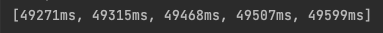
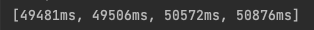

# Part One

On the server side, the size of the thread pool is 5. The client side builds variable threads to simulate multiple clients (5, 4, 3, 2, 1). Each client requests for 1000 times.

1. 5 clients, 1000 requests/client:

2. 4 clients, 1000 requests/client:

3. 3 clients, 1000 requests/client:

4. 2 clients, 1000 requests/client:

5. 1 client, 1000 requests/client:

If the size of the thread pool of the server is set to be 3.

1. 5 clients, 1000 requests/client:

2. 4 clients, 1000 requests/client:

3. 3 clients, 1000 requests/client:

