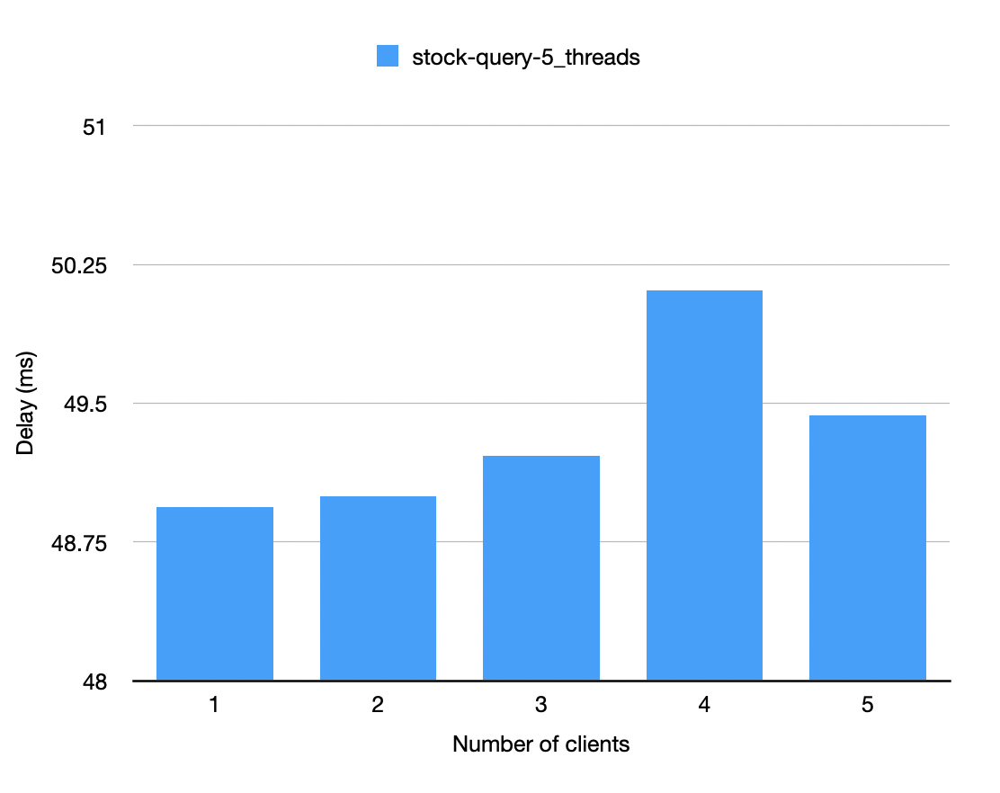

# Part One

On the server side, the size of the thread pool is 5. The client side builds variable threads to simulate multiple clients (5, 4, 3, 2, 1). Each client requests for 1000 times.

1. 5 clients, 1000 requests/client:

2. 4 clients, 1000 requests/client:

3. 3 clients, 1000 requests/client:

4. 2 clients, 1000 requests/client:

5. 1 client, 1000 requests/client:

If the size of the thread pool of the server is set to be 3.

1. 5 clients, 1000 requests/client:

2. 4 clients, 1000 requests/client:

3. 3 clients, 1000 requests/client:

# Evaluation

1. The first chart indicates the average delay of the `lookup` method when the number of clients increases, it seems that the average delay only have few differnces. The reason why the forth colunm is greater than others is probably influenced by the network conditions. 

2. The chart below shows the a huge difference of average delay between the `Socket` and the `gRPC` . It is obvious that `gPRC` is more efficient than `Socket` . When clients make a connection to the server in `Socket` , they will build a new communication channel and close it every time the server finishes its request and sends result back to the client. This will cost a huge overhead compared to `gRPC` where the server and a client build a channel, it will exist till a client do not send requests to the server. 

3. This chart shows that the difference between methods `lookup()` and `trade()` . Because we use `ConcurrentHashMap` here to ensure the no error on reading and writing on the stock infomation. When executing **read** operation, threads go faster, while executing **write** operation, threads go slower.

4. The final chart shows that when the number of clients is greater than the size of the thread pool on the server, the average delay of method `lookup()` will increase as the number of clients increases. Becase size of the thread pool is smaller than clients, when requests sent to the server,   some of them will wait till the requests in the pool are executed. This will lead to more delay on requests waiting to be executed. The second column of 5 threads may occur a network issue.
