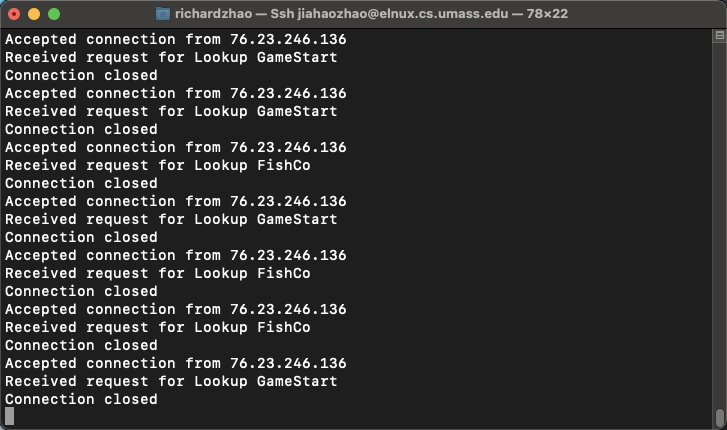
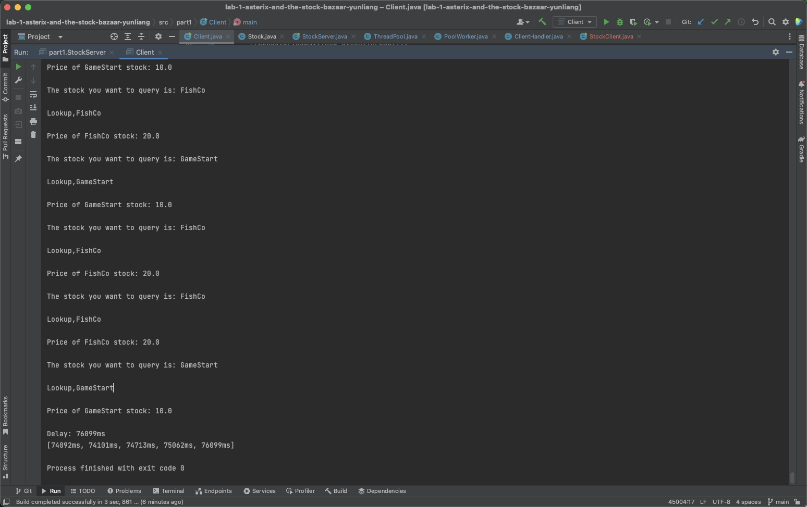
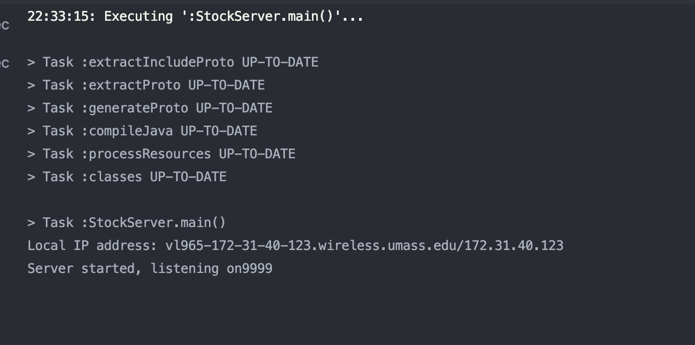
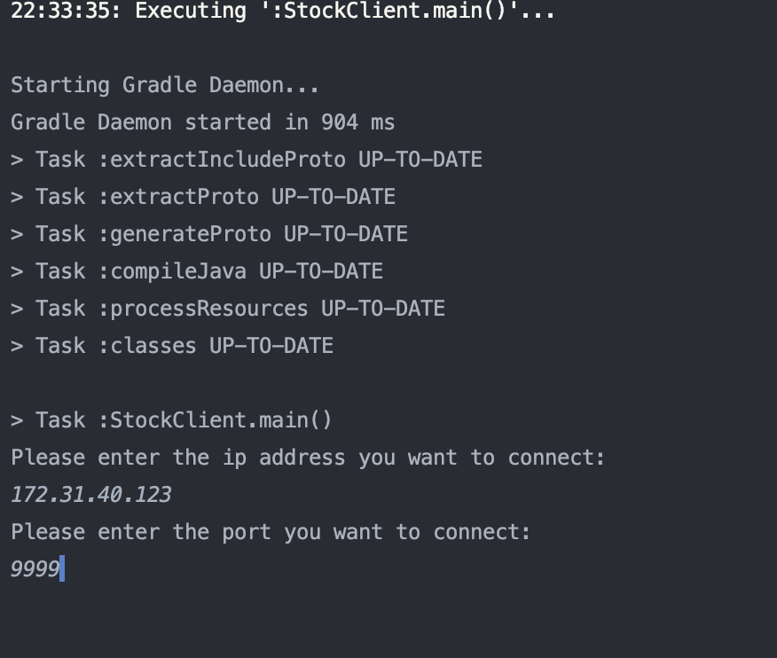
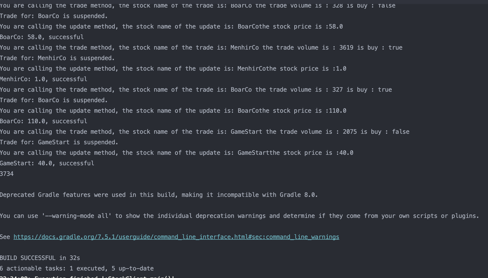
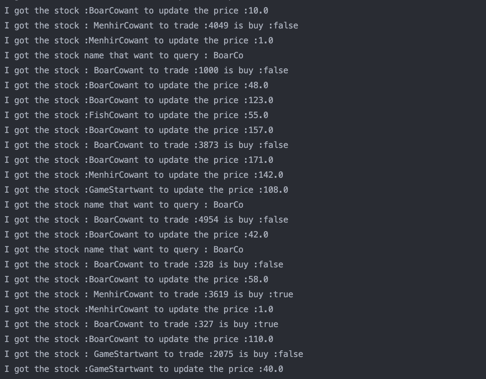

# Part one

**Output**:

On the server side, it receives requests from clients. On the terminal, for each request, it will show the ip address of the client, the query stock name and a notifition of close connection.

On the client side, it will show the message sent to the server, the result from the server and the total delay of each client for sending 1000 request to the server.

# Part two

**OutPut**
1. When the server side is started, the terminal will display the corresponding IP address and service port
   
2. After starting the client, you should enter the corresponding IP address and port number to get a connection to the server
   
3. 1000 connections will then be made while simulating 5 clients concurrently accessing the server with random commands using a thread pool
4. Client: The last number indicates the total latency after the last thread is finished
   
5. Server: Logging request information from the client
   