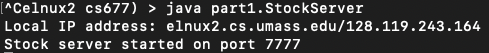
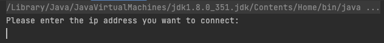
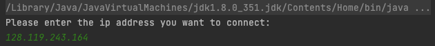

# Part 1
## Quick Start
First you should change your root directory to part1
on sever side:
```
javac -d ./ Client.java ClientHandler.java PoolWorker.java Stock.java StockServer.java ThreadPool.java
```
```
java part1.StockServer
```



on client side:
```
javac -d ./ Client.java ClientHandler.java PoolWorker.java Stock.java StockServer.java ThreadPool.java
```
```
java part1.Client
```



3. enter the ip address of the server



# Part2
## Quick Start
First you should change your root directory to part2


Build project:

```
./gradlew installDist
```

Run the server:

```
./build/install/part2/bin/stock-server
```

From another terminal, run the client:

```
./build/install/part2/bin/stock-client
```
