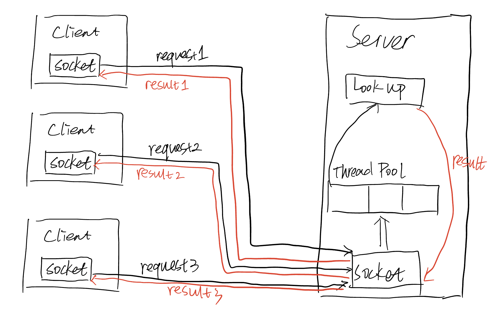
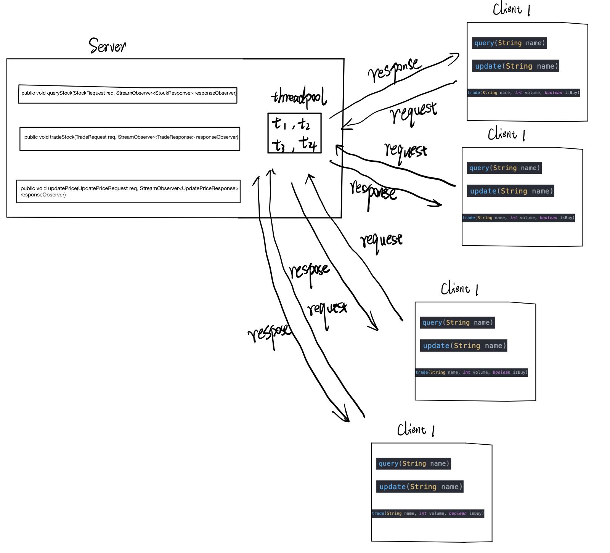

# PART 1

## Problem Statement

There is a need to build a simple stock query system to check the price with a given stock name. Clients can access to this system at any time.

## Goals:

- Build a simple stock client that can send specific messages like `Lookup,<stockName>` to the server to call a `lookup` method on the server.
- Build a simple stock server that can deal with calls from the clients and send stock infomation (name and price) back to the clients.
- Implement a thread pool on the server-side to make sure that it can deal with multiple clients  request concurrently at the same time.

## Solution

The communication between the server and clients is made by `Socket` . For server, it will build a socket to listen to the requests from the clients. For clients, they need to know the ip address of the server and make the connection. For thread pool, we use `Queue` to make sure the server deal with the request one by one.

## Implementation

- Socket for server: The `Socket` will build a connection between the server and clients. First, the server will `bind()` its **ip address** and **port** , then `listen` for a request send to it. When it receives a connection request from a client, it will `accept()` it and makes a communication with `Stream` . Then, it will split the message sent by the client to run a specific method on the server-side. Return the result back. Finally, `close()` the connection and wait for another request from the clients.

- Socket for client: First the client should connect to the server based on **ip address** and **port** of the server. Then use `Stream` to send a message  `Lookup,<stockName>` to ther server. After receives the result from the server, `close()` the connection. If the client side want to lookup again, the whole process will repeat again.

- Thread pool: In Part one, we build our own thread pool using `Queue` . When building the new object `threadPool` in part one. A queue will be build to store the request from the clients, and finish the request one by one. When the queue is empty, it will wati until a request is added to it. `Synchronized` is essential to **control the access of multiple threads to any shared resource** .
  Build a client that implements the query stock function, the trade stock function and the update stock function, as well as a for loop of requests that can be looped 1000 times, and by using the random function to randomly select the requested function (query, trade, update) among the 1000 looped requests and randomly select the stock for the operation ( GameStart, FishCo, BoarCo, MenhirCo)Build a client that implements the query stock function, the trade stock function and the update stock function, as well as a for loop of requests that can be looped 1000 times, and by using the random function to randomly select the requested function (query, trade, update) among the 1000 looped requests and randomly select the stock for the operation ( GameStart, FishCo, BoarCo, MenhirCo)
## Diagram

## Citations

1. socket [https://docs.oracle.com/javase/7/docs/api/java/net/Socket.html](https://docs.oracle.com/javase/7/docs/api/java/net/Socket.html)

# PART 2

## Goals

We need to use gRPC and Java's own dynamic thread pool API to build a simple distributed stock trading system, the server side can support concurrent access to the service, the client can concurrently access the server side, while supporting three main functions, query stock prices, trade stocks, and update stock prices

## Solution:
- Client :Build a client that implements the query stock function, the trade stock function and the update stock function, as well as a for loop of requests that can be looped 1000 times, and by using the random function to randomly select the requested function (query, trade, update) among the 1000 looped requests and randomly select the stock for the operation ( GameStart, FishCo, BoarCo, MenhirCo)

- Server :Build a server side, use ConcurrentHashMap on the server side to store the name of the stock, the price of the stock and the volume of stock transactions, because ConcurrentHashMap is thread-safe in the case of high concurrency, it can ensure the safety of data in a large number of read and write operations, at the same time, use Java's own thread pool API to implement The server side supports concurrent access requests from clients

## Diagram

## Citations
1. gRPC https://grpc.io/docs/languages/java/basics/
2. Java's built in threadpool https://docs.oracle.com/javase/tutorial/essential/concurrency/pools.html
3. ConcurrentHashMap https://docs.oracle.com/javase/8/docs/api/java/util/concurrent/ConcurrentHashMap.html